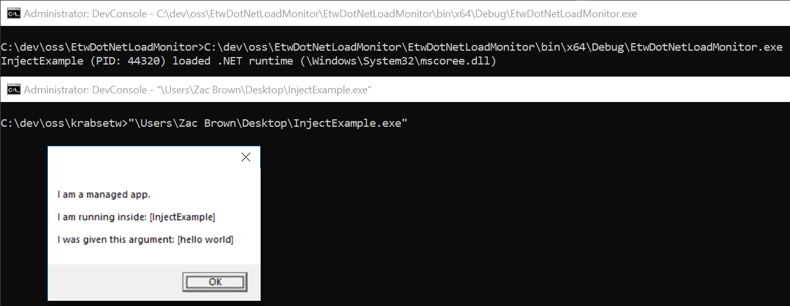

# EtwDotNetLoadMonitor
Detect when core .NET dll's are loaded into processes.

# Testing the Tool
Run InjectExample.exe. This tool is borrowed from CLRGuard for testing the EtwDotNetLoadMonitor. The original can be found [here](https://github.com/endgameinc/ClrGuard/blob/master/Testing/InjectExample.exe).

# Example
